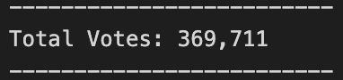
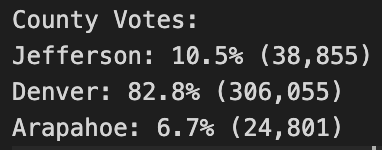
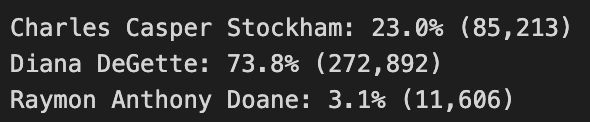
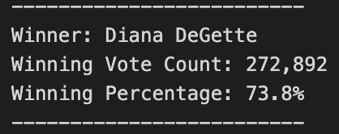

# **PYTHON AS AN ALTERNATIVE TO AUDIT ELECTION RESULTS**

## ***OVERVIEW***

### The purpose of this analysis is to demonstrate that Python is a very good alternative to MS Excel in automating the vote count audit for the congressional dictrict elections in Colorado. By proving the sucess of the analysis, this method can then be used with confidence in more elections to come.

## ***RESULTS***

### **1. Total vote count**

#### The total number of votes can be obtained by using the following code:
```
# Read the csv and convert it into a list of dictionaries
with open(file_to_load) as election_data:
    reader = csv.reader(election_data)

    # Read the header
    header = next(reader)

    # For each row in the CSV file.
    for row in reader:

        # Add to the total vote count
        total_votes = total_votes + 1
````
#### Which will give us a total count of:



### **2. Votes per County**

#### By using the following code, we will get the votes per each participating County:
```
        # county does not match any existing county in the county list.
        if county_name not in county_options:

            # 4b: Add the existing county to the list of counties.
            county_options.append(county_name)

            # 4c: Begin tracking the county's vote count.
            county_votes[county_name] = 0

        # 5: Add a vote to that county's vote count.
        county_votes[county_name] += 1
```
### And the result will be:



### **3. County with the Highest vote count**

#### The following code will help us get the information:
```
            # 6f: Write an if statement to determine the winning county and get its vote count.
            if (cvotes > largest_count) and (vote_percentage > winning_percentage):
                largest_count = cvotes
                largest_county = county_name
```
### This will give us the following:


### **4. Votes per Candidate**

#### Additionally, we can get the participation for each candidate with the next piece of code:
```
for candidate_name in candidate_votes:
            # Retrieve vote count and percentage
            votes = candidate_votes.get(candidate_name)
            vote_percentage = float(votes) / float(total_votes) * 100
            candidate_results = (f"{candidate_name}: {vote_percentage:.1f}% ({votes:,})\n")
```
### Obtaining the following result:



### **5. Winner of the Election**

#### Finally, we can obtain the winner of the election by using the following code:
```
            # Determine winning vote count, winning percentage, and candidate.
            if (votes > winning_count) and (vote_percentage > winning_percentage):
                winning_count = votes
                winning_candidate = candidate_name
                winning_percentage = vote_percentage
```
#### Which will allow us to have the following data:



## ***AUDIT SUMMARY***

### As the Election Comission can appreciate, using Python to automate the election vote audit would be a very good improvement comparing it to the analysis made so far with MS Excel. Moreover, this same code can be used in any election whether it is for another district, senatorial or even local elections. The folling examples will clarify how the code can be used with minor adjustments:

### 1) For the case of other voting methods, such as punch cards or DRE counting, we can just replace the stored data file in this part of the code:
```
# Add a variable to load a file from a path.
file_to_load = os.path.join("Resources", "election_results.csv")
```
### 2) And if we wanted to use this for senatorial or local elections, we would just need to define a new list any of them in the following part of the code, and use it along the program.
```
# 1: Create a county list and county votes dictionary.
county_options = []
county_votes = {}
